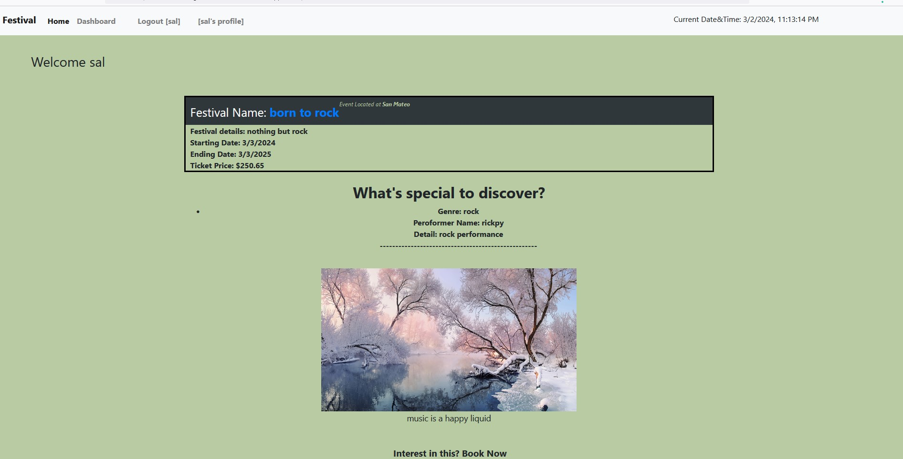

# FestivalHub

A web platform designed to serve as a centralized hub for music festival enthusiasts worldwide. The platform provides users with a one-stop destination to explore, discover, and plan their festival experiences. FestivalHub features a vast database of worldwide music festivals offering detailed information about each event including: line-up, venue, date, ticket prices. Users also receive recommendations based on their music tastes and personalize their festival preferences. 

## Table of Contents

- [About](#about)
- [Getting Started](#getting-started)
- [Installation](#installation)
- [Description](#description)
- [Screenshots](#screenshots)
- [Usage](#usage)
- [Contributing](#contributing)
- [License](#license)
  

## About

## Getting Started

## Description

This full-stack application was developed so that users could come create and interact with content regarding festival events posted in this application. The application gives users a space to store created festival events that were booked by the user via the dashboard page, comment on other festival events, as well as delete their festival bookings. When arriving to the homepage, users will be able to see all current music festivals without needing an account, however will be directed to login or create an account when trying to access the dashboard, or in trying to create or view specific festival events. User authentication via session storage and cookies is utilized in the application and offers a secure profile through specific routing and page protection. Users passwords are hashed through the bcrypt dependency before being entered into the MySQL database giving additional safeguards to users.

This project implements a model-view-control (MVC) specific set up, uses the object-relational-mapping (ORM) dependency Sequelize to connect the front-end code (UI) to the database, and Express routing. This project also utilizes handlebars templating engine which allowed data to be passed from the database and appended to the front-end in a DRY and simplified way.

Challenges faced when creating this application were the use of the handlebars template engine. This was my first time using one, and it took quite a bit of tinkering to find the best way to give certain partials access to the data I wanted to pass to the page. I also still struggle a bit with routing, and middleware in regards to the syntax used. This was the first full-stack web application I have built, so there was definitely a few times where I felt overwhelmed with the amount of files I was needing to comb through, however I eventually did get the feel for how all the different parts connected resulting in the completed application 

The user then can logout and end their session or a timeout exists on the session as well. 

## Screenshots

## Usage

Heroku Link:  https://festival-hub-g6-02035039c638.herokuapp.com/
* In order to run the application, click on the [FestivalHub]( https://festival-hub-g6-02035039c638.herokuapp.com/)
The following animation demonstrates the application functionality:

## Installation

1. Clone the repo:

2. Open in VS Code. If you do not have VS code you must install it.

3. Using the terminal, install node.js v16. If you have homebrew, the command should look like the following (brew install node@16), however this may vary and the documentation should be consulted.

4. Once node.js v16 is installed, in the terminal, utilize the command npm init -y to initialize and create a package.json where project files will be stored.

5. Next, use the terminal to run the command npm i to install the dependencies associated with this application (developers may need to install dependencies directly from the command line).

   Commands to install each dependency:

   - Command for sequelize will be npm i sequelize
   - Command for mysql2 will be npm i mysql2
   - Command for express will be npm i express@4.18.2
   - Command for dotenv will be npm i dotenv
   - Command for nodemon will be npm i nodemon
   - Command for bcrypt will be npm i bcrypt
   - Command for bootstrap will be npm i bootstrap
   - Command for connect-session-sequelize will be npm i connect-session-sequelize
   - Command for express-handlebars will be npm i express-handlebars
   - Command for express-session will be npm i express-session

6. Next, you will need to make sure you have an added .env file within the root directory of your repository, within which you will pass your environmental variables specifying the database name, your MySQL username, and your MySQL password. This will need to be completed before running the application, and will allow the connection.js file to utilize your environmental variables keeping your sensitive information protected. (Note: there is a .env.EXAMPLE file, makesure rename it to .env and change the DB_USER='your sql username' and DB_PASSWORD='your password sql to login')

7. If you do not have a MySQL account, you will need to create one (see https://dev.mysql.com/doc/mysql-installation-excerpt/5.7/en/).

8. Once all dependencies are installed, you will need to create the database. To do this you will need to navigate to the directory db directory containing the schema.sql file. Once there, you will need to open up a MySQL shell using the command mysql -u root -p, where you will then be prompted to enter you password. Once your password is entered you will be in the MySQL shell.

9. Once in the MySQL shell you will then run the command source schema.sql. This will create the database.

10. Once the database has been created, you will then need to seed the database (this will also create the model structure for the tables within the database). To do this, navigate to the root directory and run the command npm run seed. This needs to be done from the root directory because the .env file lives within the root.

11. Once the database has been seeded, you will then be able to run the command npm start from the root directory to spin up the server. With nodemon installed, you will also be able to utilize the command npm run watch to keep the server spun up between code edits.

12. From there, you can utilize applications such as Insomnia to test the functionality of the routes within the program and make edits to both the front-end and back-end of the code base.

## Technologies

This application is powered by Node.js (v16.19.1), Express.js (v.14.18.2), JavaScript, MySQL, Sequelize (ORM), and Handlebars (template engine). It utilizes the node package manager (npm) dependencies sequelize (v6.31.1), mysql2 (v3.3.0), express (v4.18.2), dotenv (v16.0.3), nodemon (v2.0.22), bcrypt (v.5.1.0), bootstrap (v5.2.3), connect-session-sequelize(v.7.1.6), express-handlebars (v7.0.7), and express-session (v1.17.3). is installed for future unit testing. Also, the Insomnia application was utilized to test the functionality of routes within the program.

Contributors:  

- [Jonathan Campos](https://github.com/jmartincampos)  
- [Khoi Phan](https://github.com/khoiphan-9194)  
- [Ryan Gurley](https://github.com/gurleyryan)  
- [Isabell Virrey](https://github.com/isabellvirrey)  
- [Brian Aguilar](https://github.com/bswagy)

## License

Please refer to the [LICENSE](https://github.com/gurleyryan/Project-2-Group-6?tab=MIT-1-ov-file#MIT-1-ov-file) in the repo.
